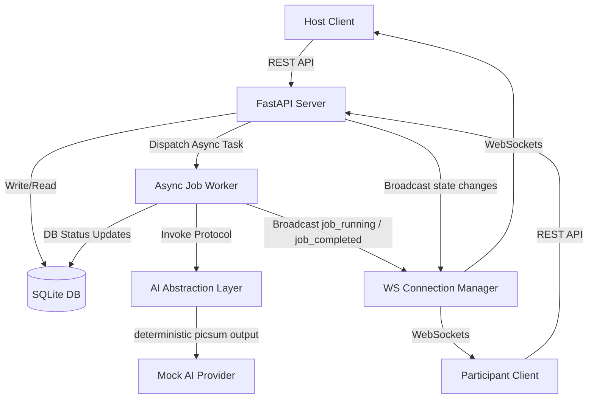

# AI Creative Battle Room

A real-time multiplayer AI-powered creative challenge arena where a Host creates a room, sets a challenge theme, and Participants submit text prompts to compete. AI generator tasks are processed asynchronously with real-time status feedback, and entries are scored using a rank-based system.

---

## 🏗️ Architecture Overview

The system is designed with a **Single Source of Truth** pattern. State is managed by the backend FastAPI engine and persisted in SQLite. The frontend React application acts as a reactive viewer that synchronizes with the server state using standard HTTP REST calls for mutations and a unified WebSocket channel per room for real-time broadcasts.



---

## 🚀 Getting Started

### Prerequisites
* Python 3.10+
* Node.js 18+

### 1. Backend Setup

1. Navigate to the `/backend` directory:
   ```bash
   cd backend
   ```
2. Create and activate a Python virtual environment (optional but recommended):
   ```bash
   python -m venv venv
   # On Windows:
   .\venv\Scripts\activate
   # On Linux/macOS:
   source venv/bin/activate
   ```
3. Install dependencies:
   ```bash
   pip install -r requirements.txt
   ```
4. Start the FastAPI development server:
   ```bash
   uvicorn app.main:app --reload --port 8001
   ```
   * The REST API will be running at: `http://localhost:8001`
   * Swagger documentation is available at: `http://localhost:8001/docs`

### 2. Frontend Setup

1. Navigate to the `/frontend` directory:
   ```bash
   cd ../frontend
   ```
2. Install dependencies:
   ```bash
   npm install
   ```
3. Launch the Vite development server:
   ```bash
   npm run dev
   ```
4. Open your browser and navigate to `http://localhost:5173`.

---

## 🗄️ Database Schema

We use SQLite for local persistence. The relational schema is mapped via SQLAlchemy:

| Table | Fields | Description |
| :--- | :--- | :--- |
| **users** | `id` (PK), `username`, `token` (Unique), `created_at` | Stores persistent player identities. |
| **rooms** | `id` (PK), `code` (Unique), `host_id` (FK), `status`, `created_at` | Rooms created by hosts. Code is a 4-letter uppercase string. |
| **participants** | `id` (PK), `room_id` (FK), `user_id` (FK), `score`, `is_eliminated`, `joined_at` | Binds users to joined rooms. Hosts are not in this table. |
| **rounds** | `id` (PK), `room_id` (FK), `round_number`, `prompt_theme`, `status`, `created_at` | Rounds generated per room (lobby, active, completed). |
| **submissions** | `id` (PK), `round_id` (FK), `participant_id` (FK), `prompt`, `created_at` | Prompts submitted by players. |
| **generation_jobs**| `id` (PK), `submission_id` (FK), `status`, `result_url`, `error`, `updated_at` | AI image status (queued, running, completed, failed, timed_out). |
| **room_events** | `id` (PK), `room_id` (FK), `event_type`, `payload_json`, `created_at` | Chronological activity feed log (supports reconnect sync). |

---

## ⚡ Real-Time Sync & Reconnection

### Messaging Lifecycle Events
WebSockets trigger updates automatically when the following events are broadcasted:
* `participant_joined` - Player entered lobby.
* `round_started` - Host defined the theme and began the round.
* `submission_created` - Participant locked in a prompt.
* `job_queued` / `job_running` / `job_completed` / `job_failed` - AI worker transitions.
* `score_updated` - Host ranked prompt creations, scores updated, round marked complete.
* `participant_eliminated` - Host eliminated a player.

### Reconnection Strategy
The client maintains a state-badge indicating network connections: `Connected`, `Connecting`, or `Disconnected`.
1. **Exponential Backoff**: If the socket closes, the client retry-connects after a delay starting at 1 second, doubling up to a maximum of 16 seconds (adding random noise jitter to prevent stampedes).
2. **Reconciliation Protocol**: When reconnecting successfully, the frontend immediately requests the `/api/rooms/{code}` REST endpoint. It reconciles local stores with the latest DB records to guarantee no events were missed during disconnection.

---

## 🤖 AI Job Worker & Watchdog

* The AI Abstraction layer defines a strict `AIProvider` Protocol.
* `MockAIProvider` simulates a delay of 3 seconds. It uses an MD5 hash of the prompt text to fetch beautiful, deterministic, prompt-specific pictures from Picsum Photos.
* Special keywords in prompt submissions trigger simulated failures:
  * Prompt containing `"fail"` → simulates internal generator failure.
  * Prompt containing `"timeout"` → sleeps for 20 seconds.
* **Watchdog watchdog**: The background worker wraps the generation task in an `asyncio.wait_for(..., timeout=15.0)` block. If it takes longer than 15 seconds, the watchdog interrupts, updates the database status to `timed_out`, and broadcasts a failure event back to the room.
* **Error Recovery**: If a job fails or times out, the creator or the host sees a `Retry Generation` button in the UI. Clicking it schedules a fresh background task using the same prompt parameters.

---

## 🥇 Scoring & Permissions

* **Role Permissions**:
  * **Host** has full administrative authority: Starting rounds, ranking submissions, and eliminating players. Hosts *cannot* submit prompts.
  * **Participants** can join lobbies and submit prompts. They *cannot* trigger round starts or scoring updates.
* **Medal Rankings**:
  * Host ranks completed creations:
    * **1st Place**: +5 points
    * **2nd Place**: +3 points
    * **3rd Place**: +1 point

---

## ⚖️ Tradeoffs & Known Limitations

* **InMemory Connection Map**: Active WebSocket connections are tracked in python memory on the web server. For a large multi-server cluster, this would require a Redis Pub/Sub backplane.
* **No Database Migrations**: DB tables are created on start-up. For production iterations, Alembic migration scripts would be introduced.
* **Mild Latency Simulation**: The mock AI provider sleeps asynchronously. In production environments, long-running tasks should be dispatched to a separate distributed Celery/Redis queue rather than FastAPI `asyncio` task threads.
